# TimeToWork - Service Booking Management System


Навчальний проєкт системи управління записами на послуги, розроблений з акцентом на правильну архітектуру бази даних, дотримання нормалізацій та роботу з ORM Entity Framework.

## Про проєкт

Це старий університетський проєкт, виконаний 3-4 роки тому (2021-2022) в університеті в рамках дисципліни **"Бази даних"**. Основна мета проєкту — продемонструвати знання та навички у:

- **Проєктуванні архітектури баз даних** — створення логічної та фізичної моделі даних
- **Нормалізації баз даних** — приведення структури до третьої нормальної форми (3NF)
- **Роботі з Entity Framework Core** — використання ORM для взаємодії з базою даних
- **Реалізації зв'язків** — One-to-Many, Many-to-Many через проміжні таблиці
- **CRUD операціях** — створення повнофункціонального веб-додатку з базовими операціями

> Проєкт розроблено на .NET 7, який вже не підтримується, бо був зроблений давно.

## Структура бази даних

### Основні сутності

#### 1. **Client** (Клієнти)
```csharp
- ID (Primary Key)
- FirstName
- LastName
- PhoneNumber
- Appointments (Navigation Property)
```

#### 2. **Service** (Послуги)
```csharp
- ServiceId (Primary Key)
- ServiceName
- ShortDescription
- Description
- Price
- ExecutionTimeHours
- ExecutionTimeMinutes
- Appointments (Navigation Property)
- ServiceAssignments (Navigation Property)
```

#### 3. **ServiceProvider** (Надавачі послуг / Працівники)
```csharp
- ID (Primary Key)
- FirstName
- LastName
- HireDate
- PlaceOfWorkID (Foreign Key)
- PlaceOfWork (Navigation Property)
- ServiceAssignments (Navigation Property)
- Appointments (Navigation Property)
```

#### 4. **PlaceOfWork** (Місця роботи)
```csharp
- PlaceOfWorkID (Primary Key)
- Location
- ServiceProviders (Navigation Property)
```

#### 5. **Appointment** (Записи на послуги)
```csharp
- AppointmentId (Primary Key)
- ClientId (Foreign Key)
- ServiceId (Foreign Key)
- ServiceProviderId (Foreign Key)
- Date
- Navigation Properties для зв'язків
```

#### 6. **ServiceAssignment** (Призначення послуг працівникам)
```csharp
- ServiceProviderId (Composite Key)
- ServiceId (Composite Key)
- Navigation Properties
```

#### 7. **Done** (Історія виконаних послуг)
```csharp
- DoneId (Primary Key)
- ClientId (Foreign Key)
- ServiceId (Foreign Key)
- ServiceProviderId (Foreign Key)
- Date
```

### Зв'язки між таблицями

```
PlaceOfWork (1) ──→ (N) ServiceProvider
Client (1) ──→ (N) Appointment
Service (1) ──→ (N) Appointment
ServiceProvider (1) ──→ (N) Appointment
ServiceProvider (N) ←──→ (N) Service (через ServiceAssignment)
```

### Нормалізація

База даних приведена до **третьої нормальної форми (3NF)**:
- ✅ **1NF:** Всі атрибути атомарні, немає повторюваних груп
- ✅ **2NF:** Відсутня часткова залежність від ключа
- ✅ **3NF:** Відсутня транзитивна залежність

Проміжна таблиця **ServiceAssignment** реалізує зв'язок Many-to-Many між працівниками та послугами, які вони можуть надавати.

## Технології

- **ASP.NET Core MVC 7.0** — Фреймворк для створення веб-додатків
- **Entity Framework Core 7.0.4** — ORM для роботи з базою даних
- **SQL Server** — Система управління базами даних
- **Razor Pages** — Шаблонізатор для представлень
- **Bootstrap** — Стилізація інтерфейсу
- **Code First Migrations** — Підхід до створення схеми БД

## Основний функціонал

- 📋 **Управління клієнтами** — додавання, редагування, перегляд та видалення клієнтів
- 💼 **Управління послугами** — каталог послуг з описами, цінами та часом виконання
- 👥 **Управління працівниками** — облік надавачів послуг та їх місць роботи
- 📅 **Система записів** — створення та відстеження записів клієнтів на послуги
- 🏢 **Місця роботи** — управління локаціями, де надаються послуги
- ✅ **Історія виконання** — облік завершених записів
- 🔗 **Призначення послуг** — зв'язок між працівниками та послугами, які вони надають

## Локальний запуск

### Передумови
- .NET 7 SDK (або новіший)
- SQL Server (LocalDB або повна версія)
- Visual Studio 2022 або Rider (опціонально)

### Кроки для запуску

1. **Клонуйте репозиторій**
```bash
git clone https://github.com/yourusername/TimeToWork.git
cd TimeToWork
```

2. **Відновіть NuGet пакети**
Пакети вже вказані в `TimeToWork.csproj` та встановляться автоматично при першому запуску, але можете явно восстановити їх:

```bash
cd TimeToWork
dotnet restore
```

3. **Налаштуйте Connection String** (опціонально)
Якщо потрібно змінити підключення до БД, відредагуйте `TimeToWork/appsettings.json`:
```json
{
  "ConnectionStrings": {
    "TimeToWorkContext": "Server=(localdb)\\mssqllocaldb;Database=TimeToWork.Data;Trusted_Connection=True;MultipleActiveResultSets=true"
  }
}
```

4. **Застосуйте міграції**

#### Вариант A: Через CLI (командний рядок / терміналу)
```bash
cd TimeToWork
dotnet ef database update
```

#### Вариант B: Через Package Manager Console (Visual Studio)
1. Відкрийте меню **Tools → NuGet Package Manager → Package Manager Console**
2. Переконайтеся, що в dropdown обрано `TimeToWork` як проєкт за замовчуванням
3. Введіть команду:
```powershell
Update-Database
```

> **Примітка:** EF Core Tools вже включені в проєкт як залежність (`Microsoft.EntityFrameworkCore.Tools`), тому додаткове встановлення не потрібне.

5. **Запустіть додаток**
```bash
dotnet run
```

## Структура проєкту

```
TimeToWork/
├── Controllers/         # MVC контролери
├── Models/              # Моделі даних (сутності)
├── Views/               # Razor представлення
├── Data/                # DbContext та конфігурація EF Core
├── Migrations/          # Міграції Entity Framework
├── wwwroot/             # Статичні файли (CSS, JS, зображення)
└── Program.cs           # Точка входу додатку
```

## Навчальні цілі, що були досягнуті

✅ Проєктування нормалізованої бази даних  
✅ Реалізація складних зв'язків між таблицями  
✅ Робота з Entity Framework Core (Code First підхід)  
✅ Використання міграцій для версіонування схеми БД  
✅ CRUD операції з використанням ORM  
✅ Scaffolding контролерів та представлень  
✅ Робота з Navigation Properties та Lazy/Eager Loading  
✅ Валідація даних через Data Annotations  
✅ Створення складеного первинного ключа (Composite Key)  

## Скріншоти

### Управління записами
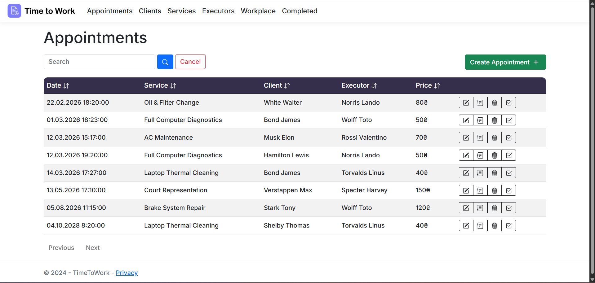
*Перегляд всіх записів на послуги*

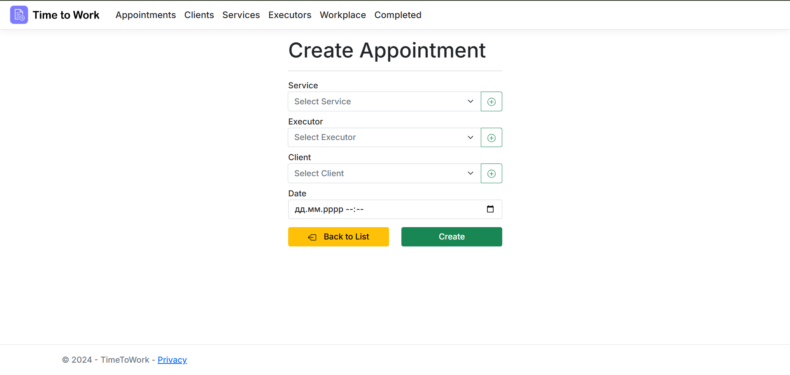
*Створення нового запису на послугу*

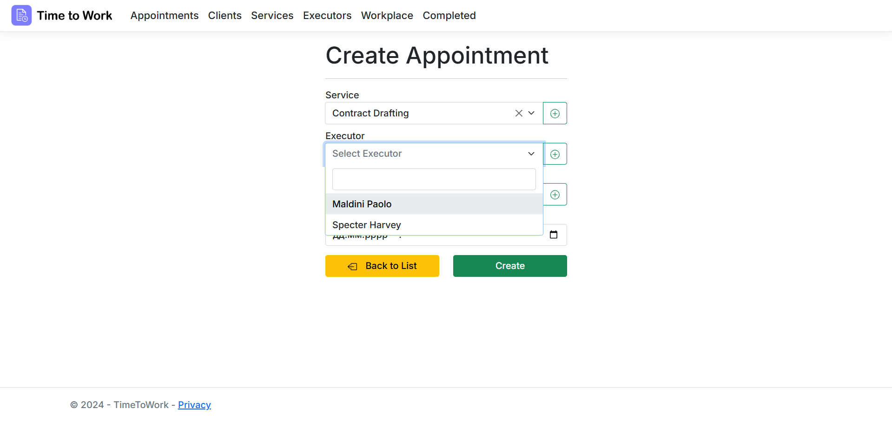
*Форма створення запису з вибором клієнта та послуги*

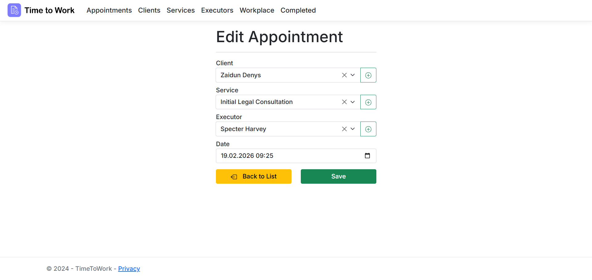
*Редагування існуючого запису*

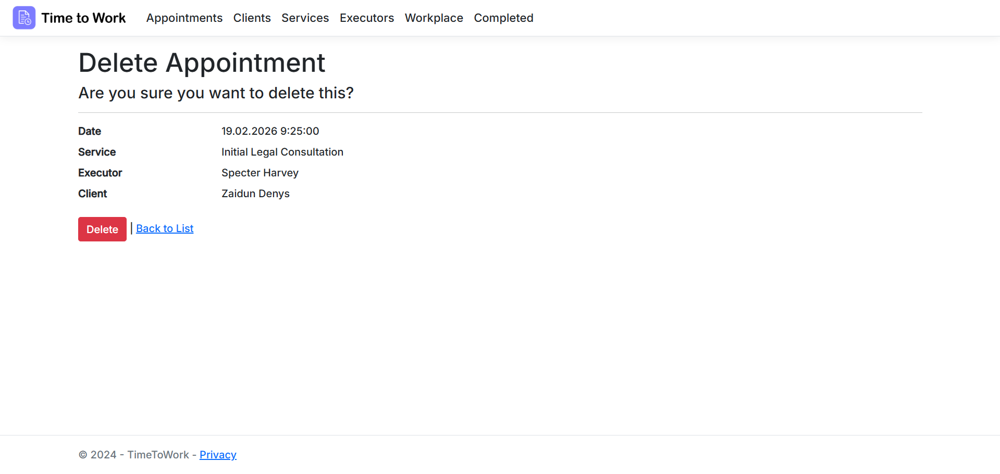
*Підтвердження видалення запису*

### Управління клієнтами
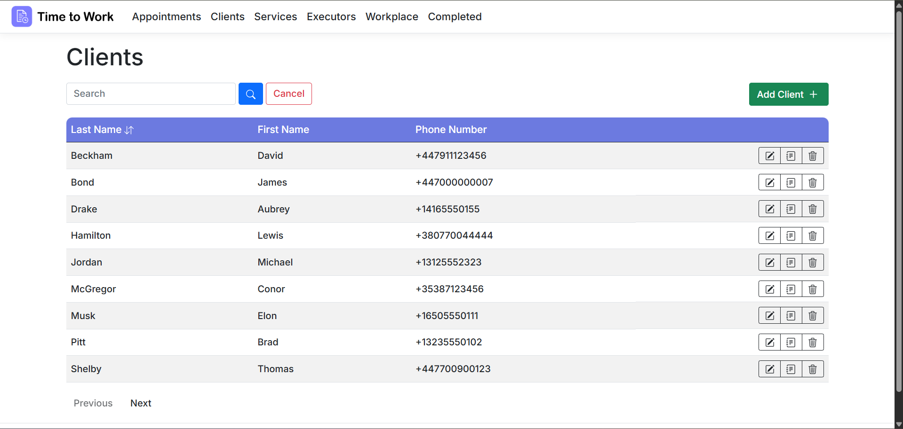
*Перегляд всіх клієнтів системи*

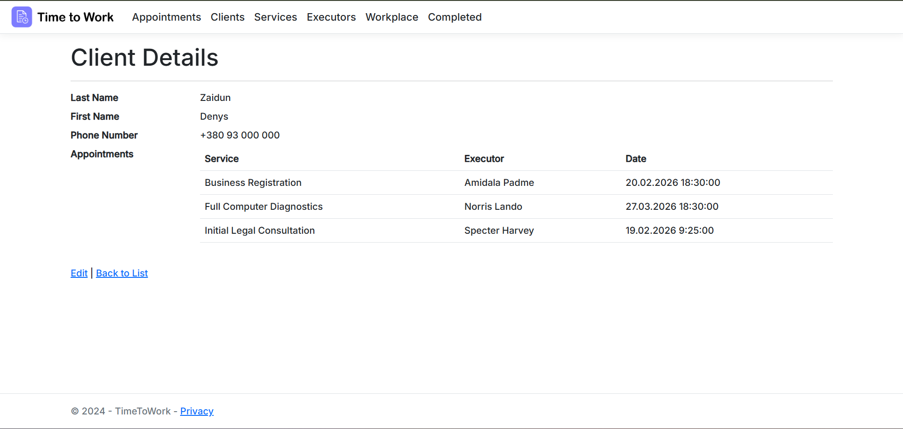
*Детальна інформація про клієнта та його записи*

### Управління послугами
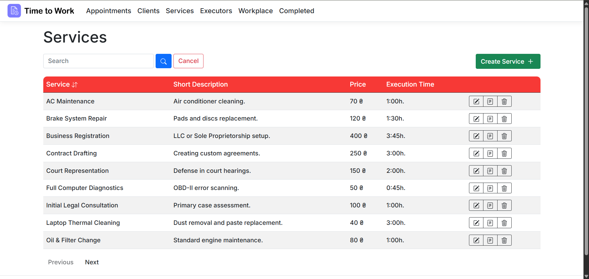
*Каталог всіх доступних послуг*

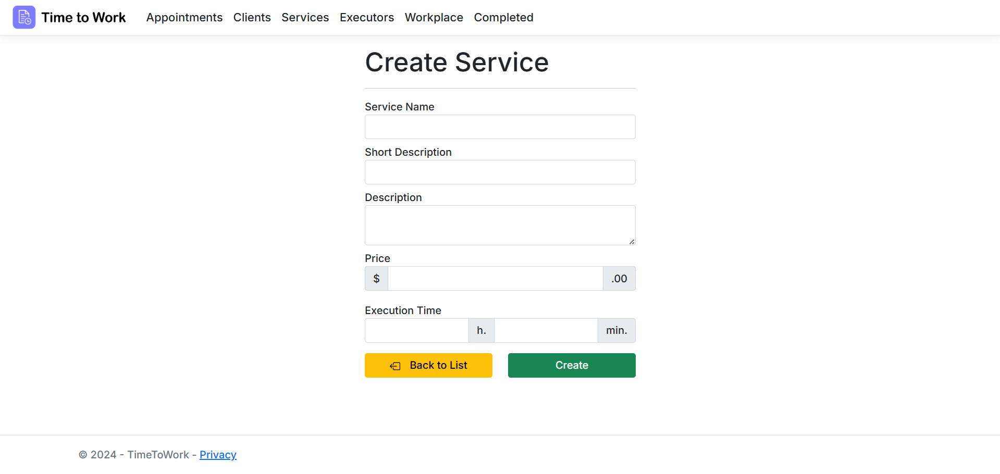
*Додавання нової послуги до системи*

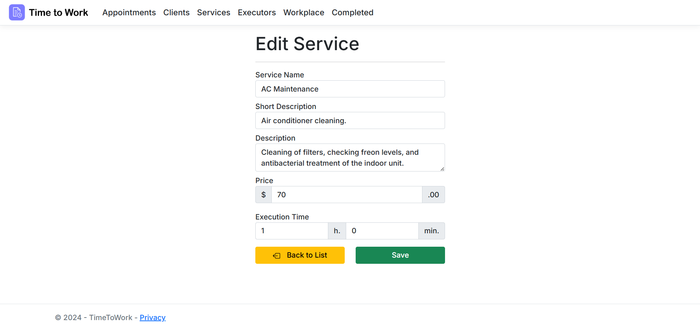
*Редагування інформації про послугу*

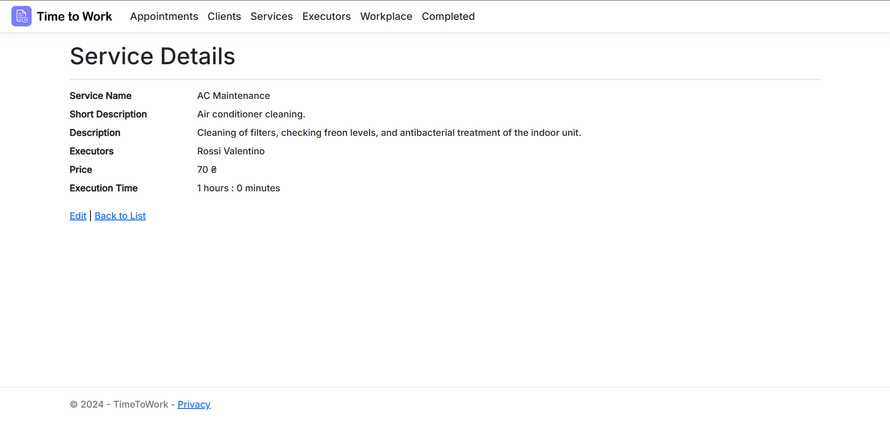
*Детальний перегляд послуги*

### Управління працівниками
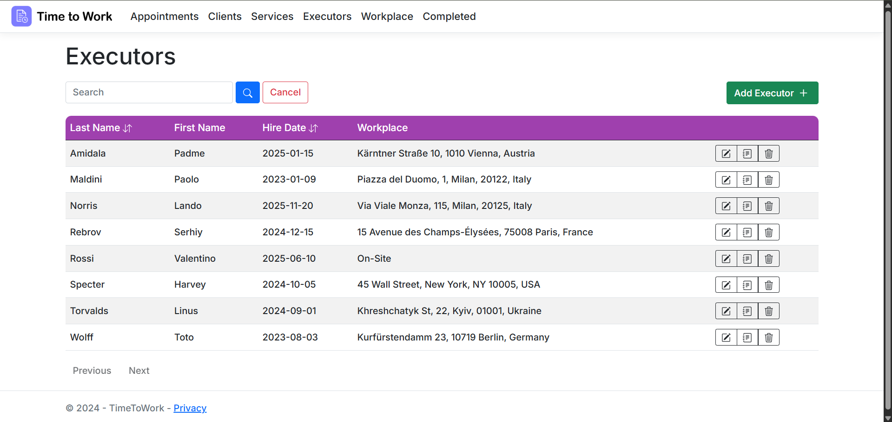
*Перегляд всіх надавачів послуг*

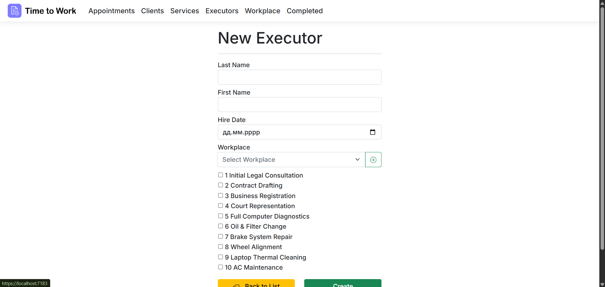
*Додавання нового працівника*

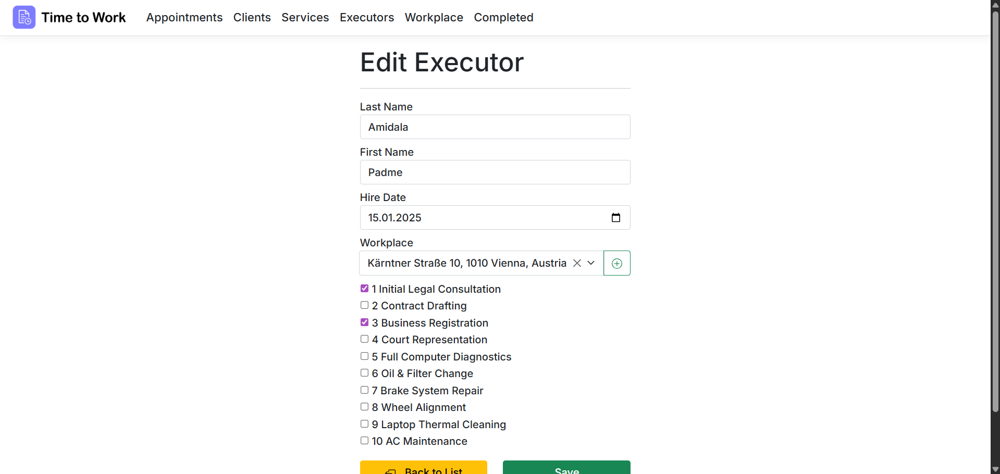
*Редагування інформації про працівника*

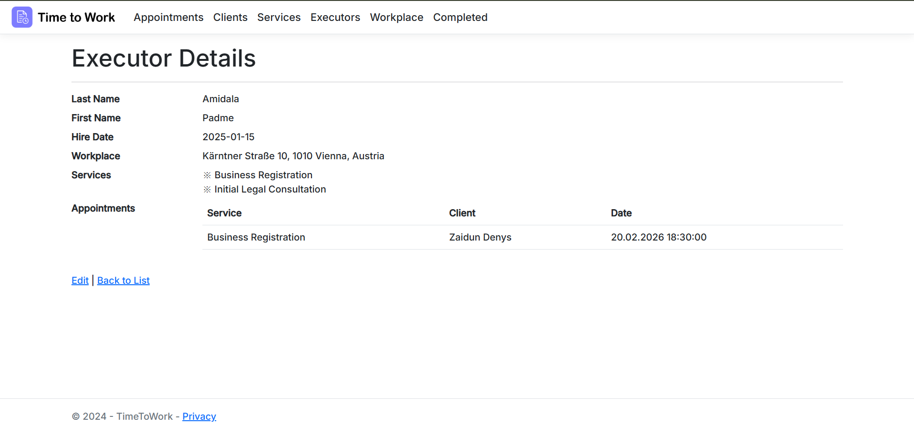
*Детальна інформація про працівника та його послуги*

## Автор

**Denys Zaidun**  
- GitHub: [dzaidun](https://github.com/dzaidun)